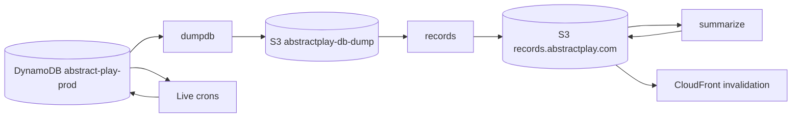

# Architecture

## Overview

[backend-crons](https://github.com/AbstractPlay/backend-crons) is a Serverless Framework v3 service (`abstract-play-backend-crons`) deployed to AWS `us-east-1`. All functions are Node.js 20 Lambdas triggered by EventBridge cron rules (prod only).

There is no API Gateway — these are batch and maintenance jobs only.

## Lambda functions

Defined in [`serverless.yml`](../serverless.yml):

| Function | Schedule (UTC, prod) | Role |
|----------|----------------------|------|
| `dumpdb` | Sun 00:00 | Export prod DynamoDB to S3 |
| `records` | Sun 03:00 | Build game records from dump |
| `records-ttm` | Sun 03:00 | Per-player time-to-move arrays |
| `records-move-times` | Sun 03:00 | Move activity histograms (180 days) |
| `tournament-data` | Sun 03:00 | Tournament summaries from dump |
| `records-manifest` | Sun 04:00 and 07:00 | S3 listing + CloudFront invalidation |
| `summarize` | Daily 06:00 | Site analytics from `ALL.json` |
| `starttournaments` | Daily 10:00 and 22:00 | Start/cancel tournaments, create games |
| `standingchallenges` | Daily 00:00 and 12:00 | Process preset standing challenges |

See [Records pipeline](/crons/pipeline/) and [Functions reference](/crons/functions/) for details.

## Gameslib Lambda layer

Functions that call `@abstractplay/gameslib` attach the `abstractplayGameslib` layer, built by [`scripts/build-layers.cjs`](https://github.com/AbstractPlay/backend-crons/blob/develop/scripts/build-layers.cjs) before packaging:

- Bundles `@abstractplay/gameslib` and `@abstractplay/recranks` into `.serverless/layers/abstractplay-gameslib`
- Strips `@abstractplay/renderer` (transitive dep, not needed at runtime)
- Prunes docs and tests from the layer to stay under Lambda size limits; retains gameslib `locales/en/` for variant name resolution during record generation

esbuild marks `@abstractplay/gameslib` and `@abstractplay/recranks` as **external** so they resolve from the layer at runtime, not from the function bundle.

## Data flow



## IAM permissions

The service role grants:

- **DynamoDB** — query/scan/get/put/update/delete, batch write, point-in-time export
- **S3** — list/get on `abstractplay-db-dump`; put on `records.abstractplay.com` and dump bucket
- **SES** — send email (tournament notifications)
- **CloudFront** — create invalidation on the records distribution

## Environment

| Variable | Source | Purpose |
|----------|--------|---------|
| `ABSTRACT_PLAY_TABLE` | `serverless.yml` | `abstract-play-{stage}` — used by `summarize` (geo stats) and live crons |

## Dependencies

| Package | Used by | Purpose |
|---------|---------|---------|
| `@abstractplay/gameslib` | records, records-ttm, records-move-times, summarize, starttournaments | `GameFactory`, `gameinfo`, `genRecord`, `addResource` |
| `@abstractplay/recranks` | records, summarize | `APGameRecord`, ELO/Glicko2/Trueskill raters |
| `ion-js`, `fflate` | dump consumers | Parse gzipped ION export files |
| `i18next` | records, starttournaments | Email copy (`apback` namespace) |

## Project layout

```
src/functions/     Lambda handlers
src/types/         Record and StatSummary TypeScript types
src/locales/       i18n strings (en, fr, it) for tournament emails
src/utils/         Shared utilities (e.g. isoToCountryCode)
scripts/           build-layers.cjs
serverless.yml     Infrastructure and schedules
```

## Related

- [Getting started](/crons/getting-started/)
- [Deployment](/crons/deployment/)
- [Backend architecture](/backend/architecture/)
