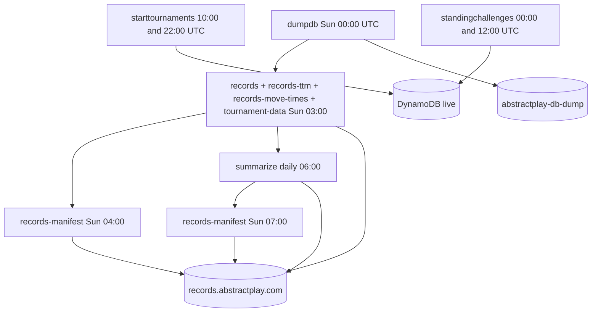

# Records pipeline

The batch pipeline runs weekly (Sunday UTC) against the latest DynamoDB export, with a daily summarize step that refreshes site analytics.

## Schedule overview

All times UTC. Prod only.

| Time | Function(s) | Depends on |
|------|-------------|------------|
| Sun 00:00 | `dumpdb` | — |
| Sun 03:00 | `records`, `records-ttm`, `records-move-times`, `tournament-data` | Latest dump in `abstractplay-db-dump` |
| Sun 04:00 | `records-manifest` | Records batch outputs |
| Daily 06:00 | `summarize` | `ALL.json` in records bucket |
| Sun 07:00 | `records-manifest` | Post-summarize refresh |

Live crons (`starttournaments`, `standingchallenges`) run on separate daily schedules and query DynamoDB directly — see [Live crons](/crons/live-crons/).

## Flow diagram

## Step 1: Database export (`dumpdb`)

Triggers a DynamoDB **point-in-time export** of the prod table (`abstract-play-prod`) to S3 bucket `abstractplay-db-dump` in ION format. AWS writes export files under `AWSDynamoDB/{uid}/data/*.ion.gz` plus a `manifest-summary.json`.

The export is asynchronous — downstream jobs find the **latest** manifest by `LastModified` and process all data files for that export UID.

## Step 2: Parallel record generation (Sun 03:00)

Four Lambdas run in parallel after the dump completes:

### `records`

Reads GAME, TOURNAMENT, ORGEVENT, ORGEVENTGAME, and BOT records from the ION dump. For each completed game (`pk=GAME`, `sk` contains `#1#`), instantiates the rules engine via `GameFactory` and calls `genRecord()` to produce an [`APGameRecord`](/recranks/).

Writes to `records.abstractplay.com`:

- `ALL.json` — all game records
- `meta/{metaGame}.json` — per-game-type lists
- `player/{playerId}.json` — per-player lists
- `event/{eventId}.json` — tournament/event groupings

### `records-ttm`

Same dump ingestion, but computes per-player inter-move durations from the game stack. Writes `ttm/{playerId}.json` (array of milliseconds).

### `records-move-times`

Builds move-activity summaries over 7, 30, 180, and 365-day windows. Writes `mvtimes.json`.

### `tournament-data`

Extracts tournament records from the dump and writes `tournament-summary.json` plus `player/tournaments/{playerId}.json` per player.

## Step 3: Manifest and CDN (`records-manifest`)

Lists all objects in the records bucket, writes `_manifest.json`, and invalidates the CloudFront distribution (`/*`). Runs twice on Sunday so `_summary.json` (from summarize) is included in the second pass.

## Step 4: Summarize (daily 06:00)

Reads `ALL.json`, computes site-wide analytics, writes `_summary.json`. See [Summarize](/crons/summarize/).

## Failure and timing

- `dumpdb` must finish before 03:00 Sunday jobs; export typically completes within a few hours
- If `records` fails, `ALL.json` is stale and `summarize` reflects old data
- `records-manifest` invalidates CloudFront regardless — clients see whatever is currently in S3

## Related

- [Functions reference](/crons/functions/)
- [S3 outputs](/crons/s3-outputs/)
- [Summarize](/crons/summarize/)
